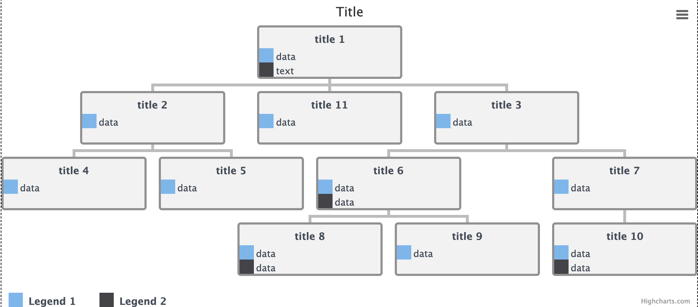

# highcharts-tree

[](https://www.travis-ci.org/hanzhangyu/highcharts-tree)
[](https://coveralls.io/github/hanzhangyu/highcharts-tree?branch=master)

## Why?

Tree chart for Highcharts.

Forked from https://github.com/skorunka/highcharts.tree. This Repo has not been updated for a long time, So I forked it, fixed some bugs, add some feature

## Require

[Highcharts](https://github.com/highcharts/highcharts) 5.0.0+

## Install from npm

```bash
npm i --save highcharts-tree
```

## Usage
Follow the three steps:
<!-- prettier-ignore-start -->
```javascript
import Highcharts from "highcharts";
// 1. import
import HighchartsTree from "highcharts-tree";
// 2. initiate plugin
HighchartsTree(Highcharts);
const chartConfig = {
  chart: {
    type: "tree",
    config: {
      // tree chart config
    },
    width: 0, // set 0 to auto size
    height: 0 // set 0 to auto size
  },
  series: [{
    data: {
      id: 1,
      content: { title: "title 1", data: ["data", "text"] },
      children: [{
        id: 2,
        content: { title: "title 2", data: ["data"] }
      },
      {
        id: 3,
        content: {title: "title 3",data: ["data"]}
      }]
    }
  }],
  title: { text: "Title" }
};
// 3. create
Highcharts.chart(idSelector, chartConfig);
```
<!-- prettier-ignore-end -->

## config
```typescript
import {HighchartsTreeConfig} from "highcharts-tree/types";
```
```js
{
  node: {
    width: 200, // node width
    height: 0, // null || 0 = auto-calculated
    marginX: 20, // node margin left and right
    marginY: 20, // node margin top and bottom
    textColor: "#454d59", // color for title and content word in node
    backgroundColor: "#f2f2f2", // background-color for node
    backgroundColorToggle: "#cccccc", // background-color for node when toggled
    title: {
      marginTop: 4, // margin-top for title
      marginDown: 4, // margin-bottom for title
    },
    padding: {
      x: 1.5, // padding left and right for node
      y: 1.5, // padding top and bottom for node
    },
    content: {
      align: "left", // text-align for content(left|center|right)
    },
    hover: { // node background-color when hovered
      backgroundColor: "#d6d6d6",
      backgroundColorToggle: "#cccccc",
    },
    border: { // border style
      width: 3,
      color: "#919191"
    },
    // format content data
    dataFormatter(date: string | number, index: number) {
      return date.toLocaleString();
    }
  },
  row: {
    height: 20, // content data height for one row
    line: 2, // row number, if content.data.length, show content.data.slice(0, line) only
  },
  tooltip: {
    enabled: false, // enable tooltip or not
    backgroundColor: "rgba(0,0,0,0.6)", // background-color
    borderRadius: "3px", // border-radius
    textColor: "#fff", // color
    width: 0, // tooltip width, set 0 to use node width
    // format tooltip content
    tooltipFormatter(item: TreeNodeData) {
      return `${item.content.title}<br>${item.content.data.join("<br>")}`;
    }
  },
  connector: { // the connector between nodes
    color: "#bcbcbc",
    width: 4,
  },
  legend: {
    enabled: true,
    nodeWidth: 20, // width for legend in node content row
    marginX: 10, // margin between legend
    marginY: 25,
  },
}
```
## Screenshot


## Changelog

see [release](https://github.com/hanzhangyu/highcharts-tree/releases)
